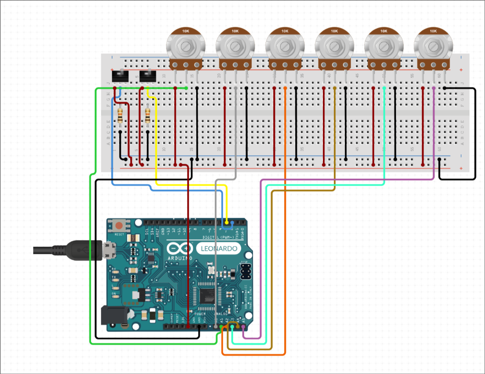

# Controlador MIDI usando um Arduino, 6 potenciômetros e 2 switches

**IMPORTANTE**: É necessário uma placa com suporte a usb nativo, como o Leonardo, Due, Micro, Zero. Ver:
[Create a MIDI Device](https://docs.arduino.cc/tutorials/generic/midi-device/)

A maior parte do trabalho é feita pela biblioteca [MIDIUSB](https://docs.arduino.cc/libraries/midiusb/).

Por conveniência, utilizo a biblioteca [ezButton](https://github.com/IPdotSetAF/EZButton).

## Componentes
 - Arduino Leonardo ou similar
 - 6x Potenciômetros 10k Ohm
 - 2 switches
 - (opcional) 2 resistores 10k Ohm[^1]

## Esquema

 

## Compilação

Utilizo por preguiça de lembrar a interface do `arduino-cli` um `justfile`.
Se tiver em mãos, utilize-o, facilita a vida.

### Descubra qual sua placa com:

```bash
just list
```

Altere o valor das variáveis `port`, `core` e `board` no arquivo `justfile` para os valores corretos.
O valor para `board` pode ser obtido removendo o valor de `core` do valor obtido
na coluna `FQBN` do comando acima.

### (Opcional) Faça alterações e adequações no arquivo `seispot.ino`

Para que o servirdor `arduino-language-server` funcione, rode:

```bash
just attach
```

### Baixe o firmware e bibliotecas

```bash
just pre
```

### Compile o sketch

```bash
just compile
```

### Envie o sketch para o Arduino

```bash
just upload
```

## NixOS

Recomendo utilizar o `flake.nix` caso esteja usando um NixOS para que sua IDE
funcione corretamente, caso o contrário fica infernal.
E use `zsh`, plmdds.

```bash
nix develop -c zsh
```

 [^1] A princípio a biblioteca ezButton dá conta.

